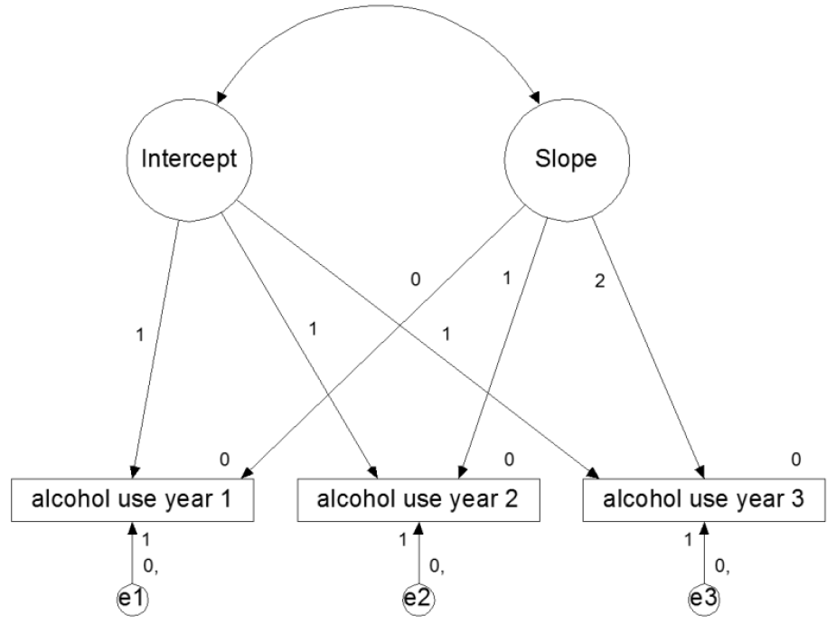

# Day 3: Latent Growth (Mixture) Modeling

```{r, include=FALSE}
library(knitr)
library(kableExtra)
library(MplusAutomation)
library(tidySEM)
library(dplyr)
knitr::opts_chunk$set(warning = FALSE, message = FALSE, results = "hide", eval = TRUE, echo = TRUE, include = TRUE)
# f <- list.files(pattern = "(inp|out|log|dat|gh5)$")
# f <- f[!f %in% c("DatingSex.dat", "DDS8_1.dat", "PTSD.dat")]
# file.remove(f)
```

This computer lab session demonstrates to run latent growth mixture models in batch, using the R-package `MplusAutomation`.
Note that, if you do not want to automate part of your workflow (like making plots and tables), you can also use Mplus exclusively.
All of the input files for the exercises described in this GitBook are provided with the course materials.

To get started with today's computer lab, first open the project file called "S23.Rproj". It should load in the program "RStudio". The bottom right panel has several tabs, including one called "Files". Click on "Files" in this bottom right tab, and click the file "mixture_exercises.R".


This computer lab session demonstrates to run latent growth models in batch, using the R-package `MplusAutomation`.
Note that, if you do not want to automate part of your workflow (like making plots and tables), you can also use Mplus exclusively.
All of the input files for the exercises described in this GitBook are provided with the course materials.

To get started with today's computer lab, first open the project file called "S23.Rproj". It should load in the program "RStudio". The bottom right panel has several tabs, including one called "Files". Click on "Files" in this bottom right tab, and click the file "growth_exercises.R". 

## Exercise 1: Latent Growth (Mixture) Modeling

### 1a. Latent Class Growth Models.

Set up the growth curve model as depicted in Figure 1 in Mplus, using the | notation. Use the file DDS8_1.dat for this.

```{r exercise_1, eval =FALSE, echo = FALSE}
data <- read.table("DDS8_1.dat", na.strings = -99)
names(data) <- c("ALC1YR1", "ALC1YR2", "ALC1YR3", "ALCPROB5", "AGE1", "GENDER1")

if(!length(list.files(pattern = "alcohol_lcga")) > 6){
  createMixtures(classes = 1:6, filename_stem = "alcohol_lcga", 
               model_overall = "i s | ALC1YR1@0 ALC1YR2@1 ALC1YR3@2;
                                i@0;  s@0;",
               rdata = data, 
               usevariables = c("ALC1YR1", "ALC1YR2", "ALC1YR3"),
               OUTPUT = "tech8 tech11 tech14;")
}

runModels(replaceOutfile = "never", filefilter = "alcohol_lcga")
mplus_output <- readModels(filefilter = "alcohol_lcga")
table <- mixtureSummaryTable(mplus_output)

createMixtures(classes = 1:4, filename_stem = "1c", 
               model_overall = "i s | ALC1YR1@0 ALC1YR2@1 ALC1YR3@2;
                                i@0;  s@0;",
               model_class_specific = "i;  s;",
               rdata = data, OUTPUT = "tech8 tech11 tech14;",
               usevariables = c("ALC1YR1", "ALC1YR2", "ALC1YR3"),
               ANALYSIS = "PROCESSORS = 4;")
runModels(filefilter = "1c", replaceOutfile = "never")
mplus_output_1c <- readModels(filefilter = "1c")
mixtureSummaryTable(mplus_output_1c)

```

{width=400px}

First, load the file `DDS8_1.dat` into the R environment. For convenience's sake, rename the columns of the data object to something a human would understand:

```{r read_data, echo = TRUE, eval = TRUE}
data <- read.table("DDS8_1.dat", na.strings = -99)
names(data) <- c("ALC1YR1", "ALC1YR2", "ALC1YR3", "ALCPROB5", "AGE1", "GENDER1")
```

Use the function `createMixtures` to define the latent class growth model as displayed in Figure 1. To see how the function `createMixtures()` works, type its name, select it, and press F1.

You can specify the model using the "|" notation. Constrain the variance of the intercept and slope factors to be equal to zero, using the Mplus syntax `i@0; s@0;`.  

In createMixtures, you can specify the overall model using the argument `model_overall = "i s | ALC1YR1@0 ALC1YR2@1 ALC1YR3@2;  i@0;  s@0;"`. The double spaces are converted to newline characters, which results in a nicely formatted Mplus file. 

Request 1 to 6 classes, by specifying the argument `classes = 1:6` for createMixtures. Request tech8, tech11 and tech14 output by specifying the argument: `OUTPUT = "tech8 tech11 tech14;"`.

To run the analysis, add the argument `run = 1L` to the `createMixtures()` call.
Make sure to store the resulting output in an object, the same way you stored the data in an object called `data` when using the function `read.table()`.

<details>
  <summary><b>Click to show answers</b></summary>

The resulting syntax should look like this:

```{r}
results_1a <- createMixtures(classes = 1:6, filename_stem = "1a",
                        model_overall = "i s | ALC1YR1@0 ALC1YR2@1 ALC1YR3@2;
                                         i@0;  s@0;",
                        rdata = data, 
                        usevariables = c("ALC1YR1", "ALC1YR2", "ALC1YR3"),
                        OUTPUT = "tech8 tech11 tech14;",
                        run = 1L)
```

\details

The function `createModels()` can run all of the analyses in batch, thus taking a lot of work out of your hands.
The function essentially performs three steps:

1. Create Mplus syntax for each of the latent class models based on `model_overall` and `model_class_specific` 
2. Use the function `mplusObject()` to turn this syntax into a model that can be evaluated
3. Use the function `mplusModeler()` to create the Mplus `.inp` files, run them, and return the results

If you use MplusAutomation for other types of models, you won't need `createMixtures()`. Instead, you can use `mplusObject()` and `mplusModeler()`.

To see what the function `createMixtures()` is doing, you should inspect each of the automatically generated input files (`.inp`). You can even run one by hand.

Finally, print a summary table to the R console by calling `mixtureSummaryTable()` on the results object.

<details>
  <summary><b>Click to show answers</b></summary>

The resulting syntax should look like this:

```{r}
mixtureSummaryTable(results_1a)
```
```{r, echo = FALSE, eval = TRUE, results = "asis"}
kbl(mixtureSummaryTable(results_1a), full_width = F)
```

\details

#### Visualization

To verify that the estimated model corresponds to the Figure above, you can use the SEM graphing package `tidySEM`.
This flexible package produces fully customizable plots based on the R graphing package `ggplot2` for Mplus (and `lavaan`) models.
If you want to make publication quality graphs, [here is an online tutorial for graph customization](https://cjvanlissa.github.io/tidySEM/articles/Plotting_graphs.html).
The script below demonstrates how to plot a model using `tidySEM`.

```{r demotidysem2, echo = TRUE, eval = FALSE}
install.packages("tidySEM")
library(tidySEM)
lo <- get_layout("I",       "",        "S",
                 "ALC1YR1", "ALC1YR2", "ALC1YR3", rows = 2)
graph_sem(results_1a[[1]], layout = lo, angle = 179)
```
```{r demotidysem, echo = FALSE, eval = TRUE}
library(tidySEM)
set.seed(5)
lo <- get_layout("I",       "",        "S",
                 "ALC1YR1", "ALC1YR2", "ALC1YR3", rows = 2)
graph_sem(results_1a[[1]], layout = lo, angle = 179)
```

### 1b. Increasing random starts

These models use random starting values. Several independent random starts are made, to ensure that the model converges on the proper solution. The default is 20 random sets of starting values, of which 4 are run to completion. Inspect the output, and look carefully if the model estimation has converged, especially for the larger number of classes. Look for warning and error messages, make sure you understand what they are telling you.

The STARTS option is used to specify the number of initial random starting values and final stage optimizations. Now, increase the number of starts to ensure proper convergence. For createMixtures, the argument is `ANALYSIS = "STARTS = .. ..;"`. 

<details>
  <summary><b>Click to show answers</b></summary>

The resulting syntax should look like this:

```{r 1bcreate_models, eval = TRUE, warning=FALSE, message=FALSE, results='hide'}
results_1b <- createMixtures(classes = 1:6, filename_stem = "1b",
                             model_overall = "i s | ALC1YR1@0 ALC1YR2@1 ALC1YR3@2;
                                              i@0;  s@0;",
                             ANALYSIS = "STARTS = 50 10;",
                             rdata = data, 
                             usevariables = c("ALC1YR1", "ALC1YR2", "ALC1YR3"),
                             OUTPUT = "tech8 tech11 tech14;",
                             run = 1L)
```

\details

Make a mixture summary table to compare the fit information of the models with 1-6 classes, with the increased number of starts, using `mixtureSummaryTable()`. Also open the output files, and inspect the estimates in each class. Which model do you prefer, and why?

<details>
  <summary><b>Click to show answers</b></summary>
The resulting syntax should look like this:

```{r 1bmake_table2, eval = TRUE, warning=FALSE, message=FALSE, results = "hide"}
mixtureSummaryTable(results_1b)
```
```{r 1a_make_table_hidden2, echo = FALSE, results = "asis", eval = TRUE}
kable_styling(knitr::kable(mixtureSummaryTable(results_1b), digits = 2, format = "html"))
```

Based on the table, I would select a 3-class model. The fit indices and (V)LMR tests essentially indicate that you can keep adding classes and improve the model, which makes it difficult to decide. However, if we look at min_N, we see that from 4 classes onward, the smallest class has less than 10% of cases assigned to it. The minimum posterior classification probability and entropy are best for the 3-class model, which means that this model can reasonably accurately assign individuals to classes.


\details

### 1c. Latent Growth Mixture Models.

Set up the same models as analyzed in the previous exercise, but now allow the means and variances of the intercept and slope factors to be freely estimated in each class. You do this by mentioning the intercept and slope explicitly in the class-specific part of the syntax. This is a more complex model, and we might therefore expect that we will need fewer classes for a good description of the data. This analysis will also take more computing time, so add `PROCESSORS=4` to the analysis section. Make a table of the fit indices, look at AIC, BIC, and the Bootstrapped LRT value (Tech 14).

<details>
  <summary><b>Click to show answers</b></summary>

The resulting syntax should look like this:

```{r}
results_1c <- createMixtures(classes = 1:4, filename_stem = "1c", 
                             model_overall = "i s | ALC1YR1@0 ALC1YR2@1 ALC1YR3@2;
                                              i@0;  s@0;",
                             model_class_specific = "i;  s;",
                             rdata = data, OUTPUT = "tech8 tech11 tech14;",
                             usevariables = c("ALC1YR1", "ALC1YR2", "ALC1YR3"),
                             ANALYSIS = "PROCESSORS = 4;",
                             run = 1L)
```

\details

### 1d. Visualizing growth models.

Plotting the model-predicted trajectories makes it easier to interpret the model. Moreover, visualizing the raw data provides yet another way to evaluate the fit of your mixture model to the data. With this in mind, plot the four models you created in exercise *1c*, and interpret what you see. First, plot only the predicted trajectories. Then, plot raw data as well. Explain the benefit of plotting the raw data in your own words.

\textit{Tip:} Because the scales in the alcohol data are ordinal, many of the observed trajectories overlap. To prevent 'overplotting', you can jitter the observed trajectories by a fraction of their standard deviation. Even as little as jitter_lines = .1, jittering the positions on the  y-axis by 1/10th of a standard deviation, can make a difference.

<details>
  <summary><b>Click to show answers</b></summary>

Plotting the raw data helps us understand how representative the average trajectory for each class captures the individual trajectories of individuals in that class. It helps us see how separable the classes are visually, instead of just relying on statistics like entropy.

The resulting plot should look like this:

```{r plot_gmm, eval = TRUE, echo = TRUE, fig.width=4.5, fig.height=3.5, fig.align = "center"}
plotGrowthMixtures(results_1c, rawdata = TRUE, jitter_lines = .1)
```

### 1e. The 3-step model.

Covariates are often added to mixture models, to predict 1) class membership 2) to explain variation in the growth parameters within the classes or 3) as a distal outcome.

Whenever covariates are however added to the model, they change the Latent Class solution. Sometimes, this is fine, as the covariates can help to improve the classification. In other cases, you would use a 3-step approach, which Mplus has automated:

1. Fit an unconditional Latent Class Model (without covariates)
2. A "most likely class variable" is created using the posterior distribution of step 1.
3. This most likely class variable is then regressed on (a) covariate.

There are a few options for how to do 3-step analysis. They all rely on adding to the `Variable:` command.
For more info, see https://www.statmodel.com/download/webnotes/webnote15.pdf.

#### Commands for conducting a 3-step model

You can add the following options to the `Variable:` command:

1. `Auxiliary = x(R);`  
    This is actually a 1-step method for predicting latent class memberships using Pseudo-Class draws.
2. `Auxiliary = x(R3step);`  
    A 3 step procedure, where covariates predict the latent class
3. `Auxiliary = y(e)`  
    A 1-step method, where the latent class predicts a continuous distal outcome.
4. `Auxiliary = y(de3step);`  
    A 3 step procedure, where latent class predicts continuous covariates (distal outcome) with unequal means and equal variances
5. `Auxiliary = y(du3step);`  
    A 3 step procedure, where latent class predicts continuous covariates (distal outcome) with unequal means and variances
6. `Auxiliary = Y(dcon);`  
    Procedure for continuous distal outcomes as suggested by Lanza et al (2013)
7. `Auxiliary = Y(dcon);`  
    Procedure for categorical distal outcomes as suggested by Lanza et al (2013)
8. `Auxiliary = y(BCH);`  
    Improved and currently best 3-step procedure with continuous covariates as distal outcomes

Pick your final model from 1c, and add both age and gender as auxiliary variables in the model. Try to think what 3-step model you want, and if you are not sure, run different models, so you can evaluate how the different procedures make a difference. You can do this by editing the Mplus file, or by adding the `VARIABLE = "Auxiliary = ...;",` to your call to ```createMixtures()```. What is the effect of both age and gender? 

*Note: The results can be extracted using the* `get_lcCondMeans()` *function.*

<details>
  <summary><b>Click to show answers</b></summary>

I'm providing an example using the BCH 3-step procedure below. It can be seen, from the overall test and the pairwise comparisons, that the third group is significantly older, and has a significantly lower proportion of girls than the other two classes.

The resulting syntax and output should look like this:

```{r}
results_1e <- createMixtures(classes = 3, filename_stem = "1e", 
                             model_overall = "i s | ALC1YR1@0 ALC1YR2@1 ALC1YR3@2;
                                              i@0;  s@0;",
                             model_class_specific = "i;  s;",
                             rdata = data, OUTPUT = "tech8 tech11 tech14;",
                             usevariables = c("ALC1YR1", "ALC1YR2", "ALC1YR3",
                                              "AGE1", "GENDER1"),
                             VARIABLE = "Auxiliary = AGE1(BCH)  GENDER1(BCH);",
                             ANALYSIS = "PROCESSORS = 4;",
                             run = 1L)

# The results of the conditional means test are inside the output object
# But you have to dig a little bit. The code to get them is:
get_lcCondMeans(results_1e)
```
```{r, echo = FALSE, eval = TRUE, results='markup'}
get_lcCondMeans(results_1e)
```

\details

## Exercise 2: Latent Transition Analysis (LTA)

### 2a. Latent transition analysis with probability parameterization

```{r, echo = FALSE, eval = FALSE}
if(!file.exists("2a_2_class.out")){
  createMixtures(
  # Create only one model, with two classes
  classes = 2,
  # Name the generated files "2a"
  filename_stem = "2a",
  # Specify the autoregressive effect
  model_overall = "c2 ON c1;",
  # Specify two class-specific models; one for each categorical latent variable
  model_class_specific = c(
  "[u11$1] (a{C});  [u12$1] (b{C});  [u13$1] (c{C});  [u14$1] (d{C});  [u15$1] (e{C});",
  "[u21$1] (a{C});  [u22$1] (b{C});  [u23$1] (c{C});  [u24$1] (d{C});  [u25$1] (e{C});"
  ),
  rdata = data,
  usevariables = names(data)[-11],
  # Speed up analysis by using 2 processors; increase random starts
  # Use probability parametrerization
  ANALYSIS = "PROCESSORS IS 2;  LRTSTARTS (0 0 40 20);  PARAMETERIZATION = PROBABILITY;",
  # Specify that the items are categorical (binary)
  VARIABLE = "CATEGORICAL = u11-u15 u21-u25;"
  )
  runModels(filefilter = "2a")
}
results_2a <- readModels(filefilter = "2a")
```

The file DatingSex.dat holds data on five indicators measured at two occasions (see MPlus example on LTA in user guide), as well as the variable gender. Read the file into memory, and name the variables:

```{r read_data_2, eval=TRUE, echo = TRUE}
data <- read.table("DatingSex.dat", na.strings = -99)
names(data) <- c("u11", "u12", "u13", "u14", "u15", 
                 "u21", "u22", "u23", "u24", "u25", 
                 "gender")
```

The u-variables represent five yes/no items (second digit represents the item) measured at two time points (first digit represents time point). Set up a model with two latent class variables for the two time points. Exclude the variable gender for now. Assume there are 2 latent classes.

Set up and run a model that restricts the thresholds (and hence response probabilities) across the two time points by first repeating the thresholds for each Latent Class (2), in both Model C1: and Model C2. To be sure Mplus does what you want, include equality constraints on the five thresholds of c1#1 and c2#1, and similarly for c1#2 and c2#2. Use the lecture slides for help in specifying the model. Check the Mplus input files manually.

Using MplusAutomation, the model can be specified as follows:

```{r, eval=TRUE, echo = TRUE, results='hide'}
results_2a <-
createMixtures(
# Create only one model, with two classes
classes = 2,
# Name the generated files "2a"
filename_stem = "2a",
# Specify the autoregressive effect
model_overall = "c2 ON c1;",
# Specify two class-specific models; one for each categorical latent variable
model_class_specific = c(
"[u11$1] (a{C});  [u12$1] (b{C});  [u13$1] (c{C});  [u14$1] (d{C});  [u15$1] (e{C});",
"[u21$1] (a{C});  [u22$1] (b{C});  [u23$1] (c{C});  [u24$1] (d{C});  [u25$1] (e{C});"
),
rdata = data,
usevariables = names(data)[-11],
# Speed up analysis by using 2 processors; increase random starts
# Use probability parametrerization
ANALYSIS = "PROCESSORS IS 2;  LRTSTARTS (0 0 40 20);  PARAMETERIZATION = PROBABILITY;",
# Specify that the items are categorical (binary)
VARIABLE = "CATEGORICAL = u11-u15 u21-u25;",
run = 1L
)
```

After running the analysis, inspect the proportions of yes/no answers for each of the indicators in the latent classes (look at probability scale in Mplus output). 

<details>
  <summary><b>Click to show answers</b></summary>

You can easily extract the parameters in probability scale from the output, using the $ sign. They will be printed to the console as a table.

Here, we examine just the first few rows of the table:

```{r}
results_2a$results$parameters$probability.scale
```

```{r 2aprobscale_hidden, echo = FALSE, results = "asis", eval = TRUE}
kable_styling(knitr::kable(head(results_2a$results$parameters$probability.scale), digits = 2, format = "html"))
```

\details

### 2b. Class proportions and transition probabilities

Examine the proportions of participants in class, based on the estimated model. Note that for each latent variable, the total proportions add up to 1. Next, examine the latent transition probabilities based on the estimated model. What do these probabilities signify?

<details>
  <summary><b>Click to show answers</b></summary>

Again, you can extract this information from the output, using the $ sign. They will be printed to the console as a table.

Your results should look like this:

```{r}
results_2a$results$class_counts$modelEstimated

```

```{r 2amodest_hidden, echo = FALSE, results = "asis", eval = TRUE}
kable_styling(knitr::kable(results_2a$results$class_counts$modelEstimated, digits = 2, format = "html"))
```

These probabilites represent the proportion of the total sample that is assigned to each class. Note that an individual can have a non-zero probability of being assigned to both classes. E.g., there might be a 70% probability that the person belongs to class 1, and a 30% probability that the person belongs to class 2. The proportions here are a sum across those probabilities for all participants. Thus, this person would contribute for 30% to the proportion of the sample in class 2.

```{r}
results_2a$results$class_counts$transitionProbs
```

```{r 2atransprob_hidden, echo = FALSE, results = "asis", eval = TRUE}
kable_styling(knitr::kable(results_2a$results$class_counts$transitionProbs, digits = 2, format = "html"))
```

These probabilites represent the probability that an individual assigned to one class at time one, will be assigned to another class at time 2. So for example, we see that people in class 1 at time 1 also tend to be in class 1 at time 2 (.76 probability).

\details

These probabilities can be visualized as a nodes-and-edges plot, using `plotLTA()`. How are the numeric results from the output reflected in the graph generated by this function?

<details>
  <summary><b>Click to show answers</b></summary>

The probabilities are mapped to the line width of the circles and lines in the plot. We see that the nodes with biggest proportion of the sample (classes C1.1 and C2.1) have thicker circles, and the edges connecting C1.1 and C2.1, and C1.2 to C2.1, are thickest, because they are the most common transitions.

```{r plotlta_2, eval=TRUE, fig.width=4, fig.height=3, fig.align = "center"}
plotLTA(results_2a)
```

\details

### 2c. Adding control variables (optional)

If there is time, you can conduct additional analyses, including gender as a control variable.

<details>
  <summary><b>Click to show answers</b></summary>

You could include gender as a control variable on the observed variables, by adding it to the `usevariables`, and including the following lines:

`u11-u15 ON gender;`
`u21-u25 ON gender;`

Alternatively, you could regress class membership on gender, to see whether men are more likely to be in a particular class than women, or vice versa. This is only allowed when you're NOT using probability parametrization. So, you would have to remove this line:

`PARAMETERIZATION = PROBABILITY;`

And add this line:

`c1 c2 ON gender;`

\details

### 2d. Extend the model to a mover-stayer model (optional)

[This Mplus FAQ](https://www.statmodel.com/download/LTA%20with%20Movers-Stayers.pdf) explains how to extend the model to a mover-stayer model. At this point, we have to forget about the function `createMixtures`: It is not suited to estimate the mover-stayer model; it can only estimate simple latent class (growth) models for a varying number of classes. However, we can use this as an opportunity to look at another function in the `MplusAutomation` package: `mplusModeler`. This function creates and runs the Mplus syntax in one step:

First, specify the Mplus model. Every argument of the function `mplusObject` corresponds to a section of an Mplus input file:

```{r, eval=TRUE, echo = TRUE}
mover_stayer_model <- mplusObject(
  VARIABLE = "CATEGORICAL = u11-u15 u21-u25;
              CLASSES = move(2) c1(2) c2(2);",
  ANALYSIS = "TYPE = mixture;
              PROCESSORS IS 2;
              LRTSTARTS (0 0 40 20);
              PARAMETERIZATION = PROBABILITY;",
  MODEL = "%OVERALL%
           c1 ON move;
           MODEL move:
           %move#1% ! Movers
           c2 on c1;
           %move#2% ! Stayers
           c2#1 ON c1#1@1;
           c2#1 ON c1#2@0; 
           MODEL c1:
           %c1#1%
           [u11$1] (a1);
           [u12$1] (b1);
           [u13$1] (c1);
           [u14$1] (d1);
           [u15$1] (e1);
           %c1#2%
           [u11$1] (a2);
           [u12$1] (b2);
           [u13$1] (c2);
           [u14$1] (d2);
           [u15$1] (e2);
           MODEL c2:
           %c2#1%
           [u21$1] (a1);
           [u22$1] (b1);
           [u23$1] (c1);
           [u24$1] (d1);
           [u25$1] (e1);
           %c2#2%
           [u21$1] (a2);
           [u22$1] (b2);
           [u23$1] (c2);
           [u24$1] (d2);
           [u25$1] (e2);",
  OUTPUT = "tech15;",
  rdata = data,
  usevariables = names(data)[-11])
```

Next, run the model we created above. You specify an input file, which will be created, and the argument `run = 1L` means you want to run the model. Set it to `run = 0L` (the default) to create syntax without running it.

```{r, eval=TRUE, echo = TRUE, results='hide'}
result <- mplusModeler(object = mover_stayer_model,
                       modelout = "mover_stayer.inp",
                       run = 1L)
```

Look in the output for the information about the response probabilities for the various latent classes. Also, look for the transition table. Which classes are the movers and which are the stayers?

```{r, eval=FALSE, echo = TRUE}
get_class_counts(result)
```

```{r, echo = FALSE, results = "asis", eval=TRUE, message=FALSE}
kable_styling(knitr::kable(result$results$class_counts$modelEstimated, digits = 2, format = "html"))
```


### 2e. Selecting the number of classes (optional)

We have not investigated whether 2 classes is the right number for this dataset. Investigate how many classes at each timepoint you would choose.

Think about:

* Whether you think there should be an equal number of classes at both timepoints (this is mostly a theoretical decision).
* How to build the model. Should you start by comparing unconstrained or constrained models?
* How to decide what solution you prefer.

