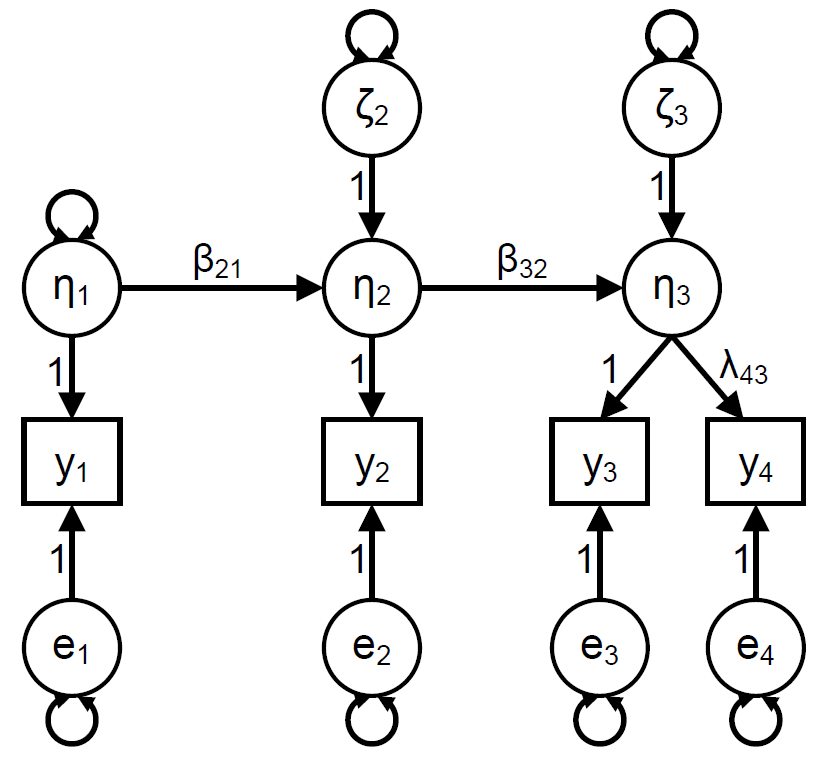
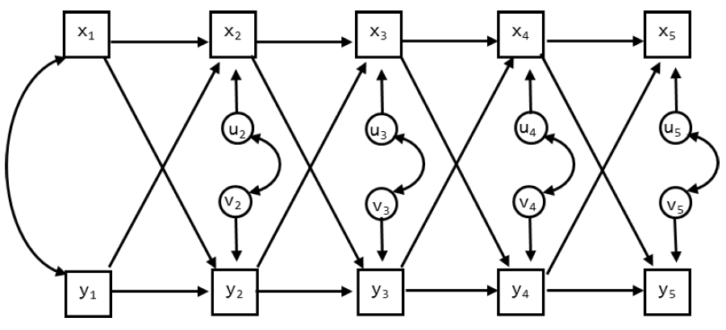

# Day 4: Cross-lagged relations

These exercises belong to day 4 of S23, ``Cross-lagged relations". The exercises consist roughly of 2 parts: first we will focus on the quasi-simplex model, and second we will focus on the random intercept cross-lagged panel model.

For the quasi-simplex model we are going to study the concept of life satisfaction. The covariance matrix is in the file `Coenders.dat` and comes from 1724 children and adolescents that participated in the *National Survey of Child and Adolescent Well-Being* (NSCAW) in Russia. They indicated how satisfied they were with their lives as a whole on a 10-point scale (1 = not at all satisfied, 10 = very satisfied). There were three waves (1993, 1994 and 1995). At the third wave, the question was asked twice (with 40 minutes in between). Hence, in total there are four measurements obtained at three waves. The data and variables commands for these data should read:

:::{}
    DATA: 
      TYPE = COVARIANCE;
      FILE = Coenders.dat;
      NOBSERVATIONS = 1724;

    VARIABLE: 
      NAMES = Y1 Y2 Y3 Y4;
:::

The researchers are interested in fitting a quasi-simplex model to these data, that is, a simplex model at the latent level, thus accounting for measurement error in the observations. This model is graphically represented in slide 19. Use the menu on the left to navigate to the exercises. The Mplus input files can found in the Summer School Dropbox-folder (`./Dropbox/Lab material - Day 4/S23 - Day 4 - 4MplusInputFiles`). 

## Quasi-simplex model

### Exercise A
Provide the names of the variances (i.e., indicate in which model matrix, and which position in this matrix they have) in the quasi-simplex graph on slide 19. What is the difference between the $e$’s and the $\zeta$’s?

  
<b>Click to show answers</b>

$e$’s are residuals at the measurement level and can be found in the $\theta$-matrix. They only influence the observation at a single occasion in time. 

$\zeta$’s are residuals of the simplex process and can be found in the $\psi$-matrix. Their effect is carried forward to future observation through the autoregressive relationships.

`r if(knitr::is_html_output()){"\\details"}`

### Exercise B
How would you specify the model in Mplus?

  
<b>Click to show answers</b>

See the Mplus input file `Exercise B.inp`. 

`r if(knitr::is_html_output()){"\\details"}`

### Exercise C

Determine the number of degrees of freedom for this model (indicate how you obtained this number). Is it possible to estimate this model?

  
<b>Click to show answers</b>

There are $\frac{4 \times 5}{2} = 10$ unique elements in $S$.

Free parameters:

- 4 residual variances at measurement level
- 1 factor variance
- 3 residual factor variances
- 3 regression parameters
- 11 parameters in total.

Therefore, we have $10 - 11 = -1$ *df*. It is not possible to estimate this model because we are trying to estimate more parameters than we have information in the data. 
`r if(knitr::is_html_output()){"\\details"}`

### Exercise D

To make sure a quasi-simplex model is identified, often the variances of the measurement errors are constrained to be equal over time. How can you do this in Mplus? How many *df* does this model have?

  
<b>Click to show answers</b>

See the Mplus input file `Exercise E.inp` for how to constrain the measurement error variances over time. With constrained measurment error variances, we estimate 3 parameters less. So, we estimate $11 - 3 = 8$ and therefore have $10 - 8 = 2$ *df*. 

`r if(knitr::is_html_output()){"\\details"}`

### Exercise E
Run the model and report on the model fit.

  
<b>Click to show answers</b>

We find the below fit indices: 

- $\chi^{2}$ = 13.29 with *df* = 2, $p = .0013$,
- RMSEA = .057,
- CFI = .994, and
- TLI = .981.

Except for $\chi^{2}$ test of model fit, the model seems to fit the data well. Note, however, that the sample size is very large and therefore the $\chi^{2}$ is likely to be significant, even for minor problems with model fit. 

`r if(knitr::is_html_output()){"\\details"}`

### Exercise F

The quasi-simplex model you just ran, led to the following warning:

:::{}
    WARNING: THE LATENT VARIABLE COVARIANCE MATRIX (PSI) IS NOT POSITIVE
    DEFINITE. THIS COULD INDICATE A NEGATIVE VARIANCE/RESIDUAL VARIANCE FOR A
    LATENT VARIABLE, A CORRELATION GREATER OR EQUAL TO ONE BETWEEN TWO LATENT
    VARIABLES, OR A LINEAR DEPENDENCY AMONG MORE THAN TWO LATENT VARIABLES.
    CHECK THE TECH4 OUTPUT FOR MORE INFORMATION.
    PROBLEM INVOLVING VARIABLE ETA4.
:::

What is the problem? 

  
<b>Click to show answers</b>

In your output, look at the reported (estimated) residual variances. We find that the residual variance of `ETA4` is estimated to be negative. This is a Heywood case and it is causing the warning to appear. Note however, that it is significant, so ``just" fixing it to 0 as a solution is probably not warrented here. 

`r if(knitr::is_html_output()){"\\details"}`

### Exercise G
As indicated in the description of the data, the third and fourth measurement were obtained at the same measurement wave (with only 40 minutes in between). Hence, the researchers proposed the following model instead of the regular quasi-simplex model. Explain why this model makes more sense for these data than the regular quasi-simplex model. Tip: check the description of the study at the beginning of this exercise. 

{width=400px}

  
<b>Click to show answers</b>

At each occasion there is a latent variable which represents Life Satisfaction. At the first two occasions there was only a single indicator of this latent variable, but at the third occasion there were two indicators.
`r if(knitr::is_html_output()){"\\details"}`

### Exercise H
How many *df* does this model have? Note that we keep the constraint on the variances of the measurement errors.

  
<b>Click to show answers</b>

There are $\frac{4*5}{2} = 10$ unique elements in S. We freely estimate: 

- 1 constrained residual variances at measurement level
- 1 factor variance
- 2 residual factor variances
- 2 regression parameters
- 1 factor loading
- 7 parameters in total.

Therefore, we have $10 - 7 = 3$ *df*. 
`r if(knitr::is_html_output()){"\\details"}`

### Exercise I
Are these two models nested? If so, how? If not, why not, and how could we compare them?

  
<b>Click to show answers</b>

Yes, they are nested: this model is a special case of the previous model, as it is based on having `ETA3` and `ETA4` from the previous model now being a single latent variable. That is, we can constrain the residual variance of `ETA4` to zero to get the alternative model. This gives us 1 *df* for the difference.
`r if(knitr::is_html_output()){"\\details"}`

### Exercise J
Specify this model in Mplus and run it. Report on the model fit.

  
<b>Click to show answers</b>

See the Mplus input file `Excercise J.inp` for the model specification in Mplus. Apart from the $\chi^{2}$-test of model fit, the model fits well: 

- $\chi^{2} (3) = 27.37$, with $p < .001$,
- RMSEA = 0.069,
- CFI = 0.987,
- TLI = 0.973, and
- SRMR = 0.039.

`r if(knitr::is_html_output()){"\\details"}`

### Exercise K
Compare the two models to each other. What can you conclude?

  
<b>Click to show answers</b>

Comparing both models using the $\Delta \chi^{2}$-test gives us $27.37 – 13.29 = 14.0$ with 1 *df* such that $p < .001$. This implies that imposing the restriction is not tenable. You can calculate the *p*-value of the $\Delta \chi^{2}$ using the `pchisq()`-function in R (with the `lower.tail` argument set to `FALSE`), or [an online tool](http://www.fourmilab.ch/rpkp/experiments/analysis/chiCalc.html)

Comparing the models using information criteria gives us AIC = 29593 and BIC = 29637 for the first model, and AIC = 29605 and BIC = 29643 for the second. In conclusion, all measures indicate the first model is better. However, the current model makes more theoretical sense, and the negative variance estimate in the first model is a problem. For these 2 reasons, we should prefer the current model.
`r if(knitr::is_html_output()){"\\details"}`

### Exercise L
Can you improve the second model in any way? Indicate which parameter you would add to your model, and what this parameter represents in substantive terms.

  
<b>Click to show answers</b>

You can get the modification indices by adding `MOD` to the `OUTPUT` command. Here, the suggested BY statements make no sense (later life satisfaction as an indicator of previous life satisfaction). With regards to the ON statement, only the suggested effect of `ETA3 ON ETA1` makes sense as we then predict forwards in time. The WITH statement suggests adding a covariance between the residuals of `y3` and `y4`. If we add this covariance and look at the standardized results, we get a correlation. This correlation actually quite high: $.522$ (SE = .044), $p < .001$. 
`r if(knitr::is_html_output()){"\\details"}`

### Exercise M
Run a model in which you include the `Y3 WITH Y4` parameter. Where will this relationship end up in the model? Does it lead to a significant improvement? How would you interpret this additional parameter?

  
<b>Click to show answers</b>

See `Exercise M.inp` for the Mplus specification of this model. The `Y3 WITH Y4` parameter is an additional covariance between the residuals of `y3` and `y4` (so not between `y3` and `y4` themselves). Model fit is quite good (except for the $\chi^{2}$-test of model fit): 

- $\chi^{2} (2) = 7.077$, $p = .0291$,
- RMSEA = 0.038,
- CFI = 0.997,
- TLI = 0.992, and 
- SRMR = 0.011. 

To compare this model to the previous model, we can do a the $\Delta \chi^{2}$-test: $27.37 – 7.08 = 20.29$, with 1 *df* such that $p < .001$, which implies that adding the covariance between the residuals leads to a significant improvement in model fit. This additional parameter implies that `y3` and `y4` have more in common with each other than what would be expected based on their common dependence on `ETA3`. Note that in the standardized results, the WITH statement can be interpreted as a correlation, and it is quite high: $.522$ (SE = .044), $p < .001$. 
`r if(knitr::is_html_output()){"\\details"}`

## CLPM & RI-CLPM
For the cross-lagged panel model (CLPM) and the random intercept cross-lagged panel model (RI-CLPM) we are going to analyze data that were reported in [Davies, Martin, Coe and Cummings (2016)](10.1017/S0954579416000237). The summary data (means, standard deviations and correlation matrix) are included in Davies.dat, and contains the means, standard deviations, and the correlation matrix. The number of observations is 232. There are 5 waves of data, taken when the child was 7, 8, 13, 14, and 15 years old. The order of the variables is:

- Child gender
- Parental education
- Interparental hostility (waves 1-5): composite score based on observational data and questionnaires, reflecting the degree of hostility between the parents
- Interparental dysphoria (waves 1-5): based on composite score based on observational data and questionnaires, reflecting the degree of dysphoria
- Child/adolescent insecurity in the relationship with the parents (waves 1-5)
- Psychological problems (waves 1-5): based on the subscales anxious/depressed, withdrawal, aggressive behaviors, and delinquency scales of the Child Behavior Checklist (CBCL), filled out by both parents.

Here we will focus on *Interparental dysphoria* and *Psychological problems* of the child. The DATA and VARIABLE commands should be:

:::{}
    DATA: 
      TYPE = MEANS STDEVIATIONS CORRELATION;
      FILE = Davies.dat;
      NOBSERVATIONS = 232;

    VARIABLE: 
      NAMES = ChildGen ParentEd
      Hos1 Hos2 Hos3 Hos4 Hos5 Dys1 Dys2 Dys3 Dys4 Dys5
      Ins1 Ins2 Ins3 Ins4 Ins5 PsPr1 PsPr2 PsPr3 PsPr4 PsPr5;
      USEVARIABLES = Dys1-Dys5 PsPr1-PsPr5;
:::

### Exercise A

How many sample statistics are there for this data set (focusing on the 5 measures of dysphoria and the 5 measures of psychological problems?

  
<b>Click to show answers</b>

There are 10 observed variables such that there are $\frac{10*11}{2} = 55$ unique elements in the observed covariance matrix S, and 10 observed means in M. Therefore, there are 55 sample statistics in total.

`r if(knitr::is_html_output()){"\\details"}`

### Exercise B
We begin with an RI-CLPM (see slide 53). For now, do not impose any constraints on the parameters across time. Draw the model, and indicate which parameters will be estimated freely. How many parameters will be estimated in total? So how many *df* are there?

  
<b>Click to show answers</b>

In the RI-CLPM we estimate:

- 2 variances for the random intercepts,
- 1 covariance between the random intercepts,
- 2 variances for the within-person centered variables at wave 1,
- 1 covariance between the within-person centered variables at wave 1,
- 8 residual variances (for the dynamic errors of both variables at wave 2-5),
- 4 covariances between the residuals (for the dynamics errors at waves 2-5),
- 16 lagged parameters (4 for each interval), and
- 10 means.

In total, we estimate 44 parameters such that we have $65 - 44 = 21$ *df*. 
`r if(knitr::is_html_output()){"\\details"}`

### Exercise C
Run the model. Check whether the number of *df* is correct. Also look at the TECH1 output, to see if you understand where the free parameters are. What is the model fit?

  
<b>Click to show answers</b>

The input for this model is in `RICLPM.inp`. The model means are estimated in the $\nu$-matrix, no parameters are estimated in the $\theta$-matrix (measurement error variances), $\lambda$-matrix (factor loadings), or $\alpha$-matrix (means/intercepts of the latent variables). The variances and covariance of the random intercepts, the within-person centered variables at wave 1, and the dynamic errors at subsequent waves are all estimated in the $\psi$-matrix. The lagged regression coefficients are estimated in $\beta$.

Apart from the $\chi^{2}$-test of model, all fit indices indicate at least acceptable fit. 

- $\chi^{2} (21) = 41.451$, $p = .005$,
- RMSEA = 0.065,
- CFI = 0.979,
- TLI = 0.956, and
- SRMR = 0.029.

`r if(knitr::is_html_output()){"\\details"}`

### Exercise D
Include the significant standardized parameter estimates for the covariances (i.e., the WITH statements) and the lagged regression parameters (i.e., the ON statements) in the figure below. Indicate which part of the model is considered the between-person part, and which part is the within-person part.

{width=500px}

### Exercise E
Omit the random intercepts. How many parameters and *df* does this model have? What is the model fit?

  
<b>Click to show answers</b>

The input for this model is `CLPMasRICLPM.inp`. The model has three parameters less (and thus 3 *df* more) than the previous model: 2 variances and the covariance for the random intercepts.

The model fit indices show that this model does not fit well: 

- $\chi^{2} (24) = 73.374$, $p < .001$,
- RMSEA = 0.094,
- CFI = 0.950,
- TLI = 0.907, and
- SRMR = 0.061.

`r if(knitr::is_html_output()){"\\details"}`

### Exercise F
Specify the CLPM and run this model. Compare it to the previous two models. How are these models related?

  
<b>Click to show answers</b>

The input for this model is in `CLPM.inp`. This model is statistically identical to the previous model; these are different parameterizations of the same model. The model fit is therefore also exactly the same. Hence, this model is a special case of the RI-CLPM. 

Comparing the two models using a chi-square difference test gives: $\Delta \chi^{2} = 73.37 - 41.45 = 31.92$ with $24 – 21 = 3$ *df*, $p < .001$. Hence, the random intercepts should not be omitted; put differently, there are stable, trait-like difference between families in the two variables (parental dysphoria and psychological problems).

However, when constraints are placed on the bound of the parameter space (which is the case here, fixing a variance to 0 is its absolute minimum value), we should actually use the chi-bar-square test ($\bar{\chi}^{2}$-test; Stoel et al. 2006). The traditional $\Delta \chi^{2}$-test does not take into account that variances can only be positive and is therefore conservative. This means that if it is significant, we are certain that the correct test (i.e., the $\bar{\chi}^{2}$ test) would also be significant.  On the other hand, when the usual chi‐square test is not significant, we do not know anything about the result of the correct test (it can be significant or not significant).

If you are working in R with the lavaan-package, you can find more information about the $\bar{\chi}^{2}$-test at [jeroendmulder.github.io/RI-CLPM/lavaan.html#(bar{chi}^{2})-test](https://jeroendmulder.github.io/RI-CLPM/lavaan.html#(bar{chi}^{2})-test). For Mplus users, there is a [Shiny app by Rebecca Kuiper](https://www.uu.nl/staff/RMKuiper/Websites %2F Shiny apps) available as well. 

`r if(knitr::is_html_output()){"\\details"}`

### Exercise G
Include the significant standardized parameter estimates for the covariances and the lagged regression parameters in the figure below.

{width=500px}

### Exercise H

Discuss how the model results differ.

  
<b>Click to show answers</b>

**Cross-lagged relationships**
In the RI-CLPM none of the cross-lagged parameters are significant. In contrast, in the CLPM there is a positive relationship from PsPr1 to Dys2. This implies that higher levels of children’s psychological problems at age 7 are followed by higher levels of interparental dysphoria at age 8. Moreover, from age 14 to 15 both cross-lagged parameters are significant and positive, indicating that psychological problems are followed by increases in interparental dysphoria, but also that increased interparental dysphoria is followed by an increase in psychological problems for the adolescent.

**Autoregressive parameters**
The autoregressive parameters in the RI-CLPM are lower, and have larger SE’s, such that fewer reach significance. This is expected as within-person stability is now captures in the random intercepts, rather than in the autoregressive effects in the CLPM. 

**Correlations**
In the CLPM only the residual correlation at wave 2 is significant; it is negative, indicating that external effects tend to have an opposite effect on these two processes; increases in Dysphoria are accompanied by decreases in psychological problems and vice versa. In the RI-CLPM, the within-person correlation at wave 1 is not significantly different from zero; however, at waves 2, 3 and 4 the correlations between the residuals is significant and negative. At wave 5 the residual variance is not significant.

In the RI-CLPM there is also the correlation between the random intercepts (i.e., the trait-like difference between families). This turns out to be a very substantial correlation of .63: Hence, in contrast to the results from the CLPM and the within-level results from the RI-CLPM, there is a strong positive relationship between trait-like levels of interparental dysphoria and trait-like levels of psychological problems.

`r if(knitr::is_html_output()){"\\details"}`

